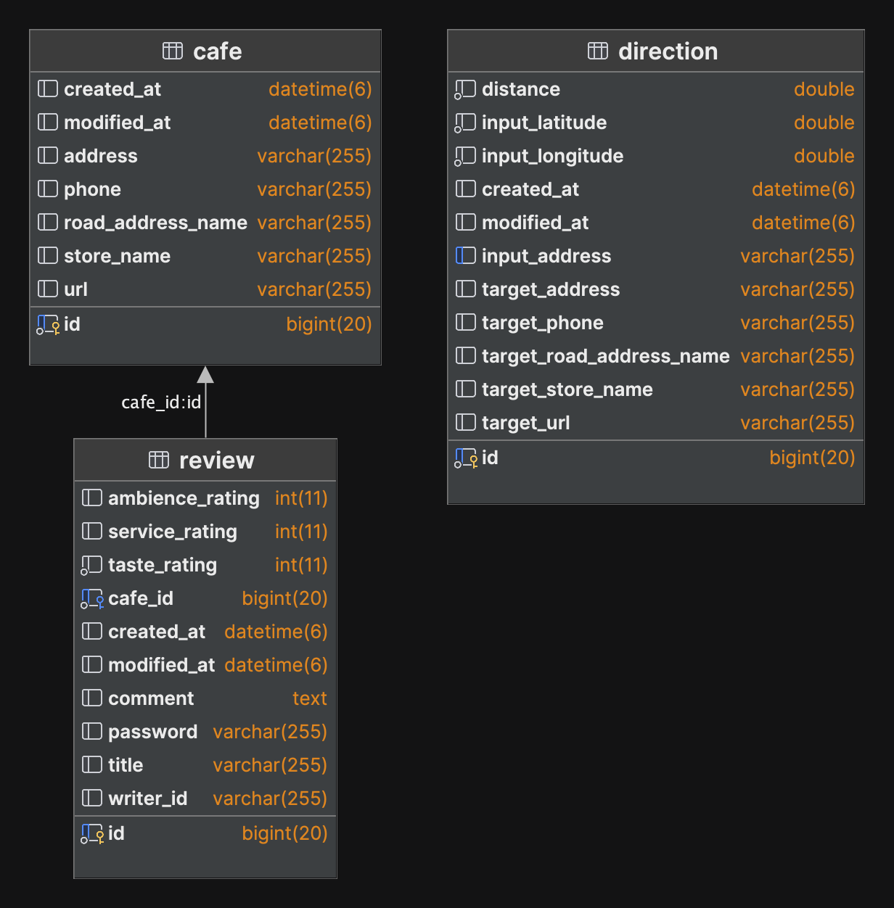

# 카페 리뷰
---
## 개발환경
---
- Intellij IDEA Ultimate
- Java 17
- Node: 21.7.3
- Gradle 8.7
- Spring Boot 3.3.0
## 기술 세부 스택
---
Spring Boot
- Spring Data JPA
- Validation
- Spring web
- Spring Configuration Processor
- Lombok
- Spring security crypto
- Mariadb 
그외
- Vue
- Docker
- AWS EC2
- QueryDSL
## 다이어 그램
---
### DB

### 시퀀스
